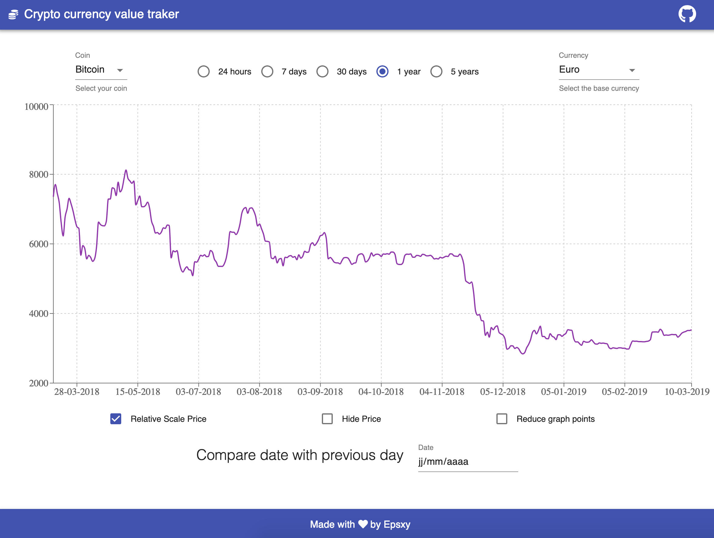

# Track crypto currency values

## Demo



## Features

This application displays the history of some crypto currencies value.

- More than 50 crypto currencies
- Select 5 different time lenghts:
  - 24 hours
  - 7 days
  - 30 days
  - 1 year
  - 5 years
- Possibility to choose between 3 currencies (EUR, USD, JPY)
- Set Y Axis scale as relative/absolute
- Hide Y Axis, to have a bigger size for mobile navigation
- Reduce graph points by computing mean values. 1 every hour for for 24h time length, 1 every day for 7d time length or 30d time length, 1 every month for 1 year or 5 years time length.

## Install

```
git clone https://github.com/epsxy/track-coin-values
// install dependencies
npm install
// start the app in dev mode, available in the browser at localhost:3000
npm run start
// build for prod
npm run build
```

## Licence

Copyright 2019 Epsxy

Permission is hereby granted, free of charge, to any person obtaining a copy of this software and associated documentation files (the "Software"), to deal in the Software without restriction, including without limitation the rights to use, copy, modify, merge, publish, distribute, sublicense, and/or sell copies of the Software, and to permit persons to whom the Software is furnished to do so, subject to the following conditions:

The above copyright notice and this permission notice shall be included in all copies or substantial portions of the Software.

THE SOFTWARE IS PROVIDED "AS IS", WITHOUT WARRANTY OF ANY KIND, EXPRESS OR IMPLIED, INCLUDING BUT NOT LIMITED TO THE WARRANTIES OF MERCHANTABILITY, FITNESS FOR A PARTICULAR PURPOSE AND NONINFRINGEMENT. IN NO EVENT SHALL THE AUTHORS OR COPYRIGHT HOLDERS BE LIABLE FOR ANY CLAIM, DAMAGES OR OTHER LIABILITY, WHETHER IN AN ACTION OF CONTRACT, TORT OR OTHERWISE, ARISING FROM, OUT OF OR IN CONNECTION WITH THE SOFTWARE OR THE USE OR OTHER DEALINGS IN THE SOFTWARE.
